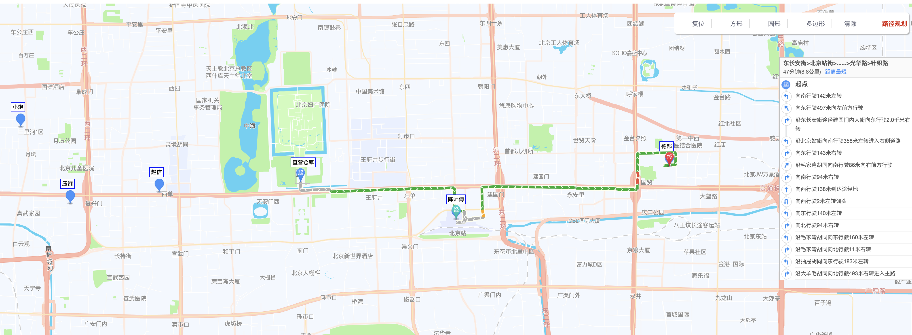

# visual-maptool
基于高德地图可视化路径分析工具 @giscafer

在线demo：https://gis520.github.io/visual-maptool/

## Development server

Run `ng serve` for a dev server. Navigate to `http://localhost:4200/`. The app will automatically reload if you change any of the source files.
